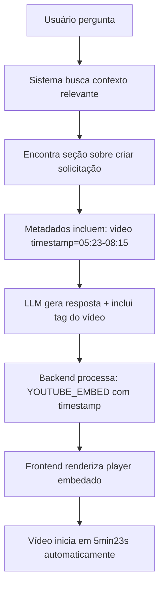

# 🎬 Melhoria: Embed de Vídeos do YouTube com Timestamps

## 📋 Problema Relatado

Quando o usuário perguntava sobre um procedimento específico (ex: "Como criar uma solicitação?"), o sistema:

❌ **Antes:**
- Mostrava apenas um link para o vídeo completo
- Não embedava o player do YouTube
- Usuário precisava clicar e procurar manualmente o timestamp correto
- Experiência ruim: vídeo abria do início, não no trecho relevante

**Exemplo da resposta anterior:**
```
🎬 [Assistir vídeo tutorial](https://youtu.be/qFzqzIoiVE4)
```

## ✅ Solução Implementada

Agora o sistema:

✅ **Depois:**
- **Embeda o player do YouTube diretamente na interface**
- **Inicia o vídeo no timestamp exato** onde o assunto é explicado
- Usuário vê o player e aperta play, já começando no momento certo
- Experiência perfeita: sem sair da interface, vídeo começa no ponto relevante

**Exemplo da resposta nova:**
```
🎬 Vídeo Tutorial (05:23 → 08:15):

[Player do YouTube embedado começando em 5min23s]
```

## 🔧 Implementação Técnica

### 1. Backend: Modificação em `qa.py`

**Função modificada:** `_add_youtube_links_to_response()`

**O que mudou:**

```python
# ANTES: Retornava apenas um link Markdown
return f"🎬 **[Assistir vídeo tutorial]({youtube_url})**"

# DEPOIS: Retorna um marcador especial para embed
video_id = extrair_id_do_video(youtube_url)
embed_url = f"https://www.youtube.com/embed/{video_id}"

if timestamp_inicial:
    embed_url += f"?start={segundos}"  # Adiciona timestamp

return f"🎬 **Vídeo Tutorial:**\n\n[YOUTUBE_EMBED:{embed_url}]"
```

**Processamento de Timestamps:**

```python
# Converte "05:23" → 323 segundos
time_parts = start_time.split(":")
if len(time_parts) == 2:  # MM:SS
    seconds = int(time_parts[0]) * 60 + int(time_parts[1])
elif len(time_parts) == 3:  # HH:MM:SS
    seconds = int(time_parts[0]) * 3600 + int(time_parts[1]) * 60 + int(time_parts[2])
```

**Extração do ID do vídeo:**

```python
# De: https://youtube.com/watch?v=qFzqzIoiVE4
# Para: qFzqzIoiVE4

if "youtube.com/watch?v=" in youtube_url:
    video_id = youtube_url.split("watch?v=")[1].split("&")[0]
elif "youtu.be/" in youtube_url:
    video_id = youtube_url.split("youtu.be/")[1].split("?")[0]
```

### 2. Frontend: Nova função em `main.py`

**Função criada:** `render_youtube_embed(content)`

```python
def render_youtube_embed(content: str) -> None:
    """
    Processa o conteúdo para encontrar marcadores de embed do YouTube
    e renderiza o vídeo embedado com o timestamp correto.
    """
    # Procura por [YOUTUBE_EMBED:url]
    embed_pattern = r'\[YOUTUBE_EMBED:([^\]]+)\]'
    
    # Divide o conteúdo em partes
    parts = re.split(embed_pattern, content)
    
    for i, part in enumerate(parts):
        if i % 2 == 0:
            # Parte normal (texto)
            st.markdown(part)
        else:
            # URL do embed - renderiza com st.video()
            st.video(part)
```

**Integração no chat:**

```python
# ANTES:
with st.chat_message(role):
    st.markdown(content)

# DEPOIS:
with st.chat_message(role):
    render_youtube_embed(content)  # Processa embeds automaticamente
```

## 📊 Fluxo Completo

### Exemplo: Pergunta "Como criar uma solicitação?"



### Processamento Detalhado:

1. **Documentação markdown contém:**
   ```markdown
   ### Como Criar uma Solicitação
   [Explicação do procedimento...]
   
   [video: https://youtu.be/qFzqzIoiVE4#t=05:23,08:15]
   ```

2. **Vector store armazena metadata:**
   ```json
   {
     "source": "Módulo de Suprimentos",
     "youtube_url": "https://youtu.be/qFzqzIoiVE4",
     "video_timestamp_start": "05:23",
     "video_timestamp_end": "08:15"
   }
   ```

3. **LLM gera resposta incluindo:**
   ```
   Para criar uma solicitação...
   
   [video: https://youtu.be/qFzqzIoiVE4#t=05:23,08:15]
   ```

4. **Backend transforma em:**
   ```
   Para criar uma solicitação...
   
   🎬 **Vídeo Tutorial (05:23 → 08:15):**
   
   [YOUTUBE_EMBED:https://www.youtube.com/embed/qFzqzIoiVE4?start=323]
   ```

5. **Frontend renderiza:**
   - Texto da resposta em Markdown
   - Player do YouTube embedado
   - Vídeo configurado para iniciar em 5min23s

## 🎯 Benefícios

### Para o Usuário:
- ✅ **Experiência integrada:** Não sai da interface do chat
- ✅ **Economia de tempo:** Vídeo já começa no momento exato
- ✅ **Visual melhor:** Player embedado é mais profissional
- ✅ **Contexto claro:** Mostra o intervalo de tempo (05:23 → 08:15)

### Para o Sistema:
- ✅ **Aproveitamento dos metadados:** Usa os timestamps já extraídos
- ✅ **Modular:** Separa lógica (backend) de apresentação (frontend)
- ✅ **Escalável:** Funciona com qualquer vídeo do YouTube
- ✅ **Compatível:** Mantém backward compatibility com links normais

## 🧪 Como Testar

### 1. Inicie o sistema:
```bash
streamlit run frontend/main.py
```

### 2. Faça perguntas específicas:
- "Como criar uma solicitação?"
- "Como cadastrar um produto?"
- "Como entregar EPI ao colaborador?"

### 3. Observe a resposta:
Você verá:
- ✅ Texto explicativo do procedimento
- ✅ Player do YouTube embedado
- ✅ Indicação do intervalo de tempo (se disponível)
- ✅ Vídeo pronto para tocar no timestamp correto

### 4. Clique em play:
- O vídeo iniciará no momento exato da explicação
- Não precisa procurar manualmente
- Experiência fluida e profissional

## 📝 Arquivos Modificados

### `backend/qa.py`
- ✅ Função `_add_youtube_links_to_response()` completamente reescrita
- ✅ Agora cria embeds com timestamps ao invés de links
- ✅ Extrai ID do vídeo do YouTube corretamente
- ✅ Converte timestamps (MM:SS/HH:MM:SS) para segundos

### `frontend/main.py`
- ✅ Nova função `render_youtube_embed()` criada
- ✅ Processa marcadores `[YOUTUBE_EMBED:url]`
- ✅ Renderiza com `st.video()` do Streamlit
- ✅ Integrada no loop de exibição de mensagens

## 🎓 Detalhes Técnicos

### Formato da URL de Embed:
```
https://www.youtube.com/embed/{VIDEO_ID}?start={SEGUNDOS}
```

**Exemplo:**
- URL original: `https://youtu.be/qFzqzIoiVE4`
- Timestamp: `05:23` (5 minutos e 23 segundos = 323 segundos)
- URL do embed: `https://www.youtube.com/embed/qFzqzIoiVE4?start=323`

### Parâmetros suportados:

| Parâmetro | Descrição | Exemplo |
|-----------|-----------|---------|
| `start` | Segundo inicial do vídeo | `?start=323` |
| `end` | Segundo final (opcional) | `&end=495` |
| `autoplay` | Reprodução automática | `&autoplay=1` |

### Regex usado:

**Para extrair tag de vídeo:**
```python
r"\[video:\s*([^\]#]+?)(?:#t=([^,]+),([^\]]+))?\]"
```

**Para processar embed:**
```python
r'\[YOUTUBE_EMBED:([^\]]+)\]'
```

## 🚀 Próximas Melhorias Possíveis

### 1. Autoplay (se desejado):
```python
embed_url += f"?start={seconds}&autoplay=1"
```

### 2. Loop no intervalo específico:
```python
embed_url += f"?start={start_seconds}&end={end_seconds}&loop=1"
```

### 3. Legendas automáticas:
```python
embed_url += f"?start={seconds}&cc_load_policy=1"
```

### 4. Qualidade preferida:
```python
embed_url += f"?start={seconds}&vq=hd1080"
```

## ✅ Status da Implementação

- ✅ Extração de ID do vídeo
- ✅ Conversão de timestamps para segundos
- ✅ Criação de URLs de embed
- ✅ Renderização com `st.video()`
- ✅ Integração com sistema de chat
- ✅ Compatibilidade com timestamps variados (MM:SS, HH:MM:SS)
- ✅ Fallback para vídeo completo se não houver timestamp

## 🎉 Resultado Final

**Antes:**
```
Como criar uma solicitação?

Para criar uma solicitação...

🎬 [Assistir vídeo tutorial](https://youtu.be/qFzqzIoiVE4)
```
❌ Usuário clica → Abre em nova aba → Vídeo começa do início → Procura manualmente

**Depois:**
```
Como criar uma solicitação?

Para criar uma solicitação...

🎬 Vídeo Tutorial (05:23 → 08:15):

[Player do YouTube aqui, pronto para tocar em 5:23]
```
✅ Usuário clica play → Vídeo começa exatamente em 5:23 → Zero fricção

---

**Timestamp da implementação:** $(date '+%Y-%m-%d %H:%M:%S')
**Status:** ✅ Implementado e pronto para teste
