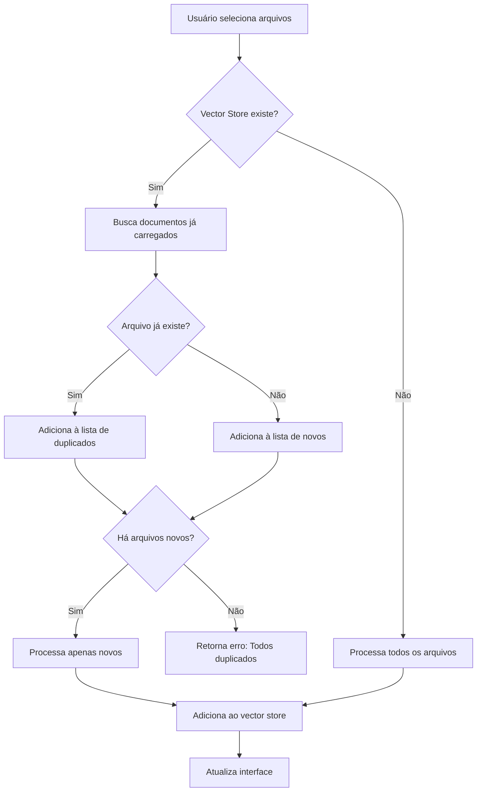

# 📋 Nova Funcionalidade: Prevenção de Duplicados

## ✨ O Que Foi Implementado

Agora a seção **"Upload de Documentos"** mostra todos os documentos já carregados no vector store e previne automaticamente o carregamento de duplicados!

---

## 🎯 Funcionalidades Adicionadas

### 1. **Visualização de Documentos Carregados**

Na seção "Upload de Documentos", você agora vê:

- 📊 **Total de documentos** indexados
- 📋 **Lista completa** de todos os documentos (em expander)
- 📄 **Informações detalhadas** de cada documento:
  - Nome do arquivo
  - Tipo (markdown, pdf, txt)
  - Número de chunks gerados
  - Módulo (se disponível)
  - Badges: 🎬 (vídeo), 🖼️ (imagens), ⏱️ (timestamps)

### 2. **Detecção Automática de Duplicados**

Quando você tenta carregar documentos:

- ✅ **Sistema verifica** automaticamente se já existem
- ⚠️ **Alerta visual** mostra quais documentos foram ignorados
- 📦 **Processa apenas** os documentos novos
- 💬 **Mensagem clara** indica quantos duplicados foram ignorados

### 3. **Botão de Limpeza da Base**

- 🗑️ **Botão "Limpar Base de Dados"** (com confirmação dupla)
- ⚠️ **Segurança**: Requer dois cliques para confirmar
- 🔄 **Recomeçar do zero** quando necessário

---

## 📊 Exemplo Visual

```
╔═══════════════════════════════════════════════════════════╗
║  📚 Documentos Já Carregados                              ║
╠═══════════════════════════════════════════════════════════╣
║  ✅ Total: 7 documento(s) indexado(s)                     ║
║                                                           ║
║  📋 Ver lista completa de documentos ▼                    ║
║  ┌─────────────────────────────────────────────────────┐ ║
║  │ 📝 Passo a passo - Módulo de Compras.md 🎬⏱️       │ ║
║  │    📦 200 chunks    🏷️ Compras                      │ ║
║  │ ─────────────────────────────────────────────────── │ ║
║  │ 📝 Passo a passo - Módulo de Engenharia.md 🎬⏱️    │ ║
║  │    📦 293 chunks    🏷️ Engenharia                   │ ║
║  │ ─────────────────────────────────────────────────── │ ║
║  │ 📝 Passo a passo - Módulo Financeiro.md 🎬⏱️       │ ║
║  │    📦 185 chunks    🏷️ Financeiro                   │ ║
║  └─────────────────────────────────────────────────────┘ ║
║                                                           ║
║  [🗑️ Limpar Base de Dados]                               ║
╚═══════════════════════════════════════════════════════════╝
```

---

## 🚀 Como Funciona

### **Fluxo de Upload com Detecção:**



---

## 📝 Arquivos Modificados

### 1. **backend/vector_store.py**

Novas funções criadas:

```python
def get_loaded_documents(vector_store) -> List[dict]:
    """
    Retorna lista de documentos únicos já carregados.
    Agrupa por arquivo source e retorna informações resumidas.
    """
    # Retorna: [{"source": "file.md", "chunks": 150, "type": "markdown", ...}, ...]

def check_document_exists(vector_store, filename: str) -> bool:
    """
    Verifica se um documento com o nome dado já existe.
    """
    # Retorna: True/False
```

### 2. **frontend/main.py**

Alterações implementadas:

1. **Importações atualizadas:**
   ```python
   from backend.vector_store import (
       create_vector_store, 
       load_existing_vector_store, 
       get_loaded_documents, 
       check_document_exists
   )
   ```

2. **Nova seção na interface:**
   - Exibe documentos carregados com detalhes
   - Expander com lista completa
   - Botão de limpeza com confirmação

3. **Funções atualizadas:**
   - `process_uploaded_files()`: Detecta e ignora duplicados
   - `load_docs_folder()`: Detecta e ignora duplicados
   - Ambas mostram alertas informativos

---

## 💡 Exemplos de Uso

### **Cenário 1: Primeira vez carregando**
```
Usuário: Carrega 3 documentos novos
Sistema: ✅ 450 chunks de 3 documento(s) processados
```

### **Cenário 2: Tentando carregar duplicados**
```
Usuário: Carrega 3 documentos (2 já existem, 1 novo)
Sistema: ⚠️ Documentos ignorados (já carregados):
         - Módulo de Compras.md
         - Módulo de Engenharia.md
         
         ✅ Processando apenas os novos documentos...
         
Resultado: ✅ 150 chunks de 1 documento(s) (2 duplicado(s) ignorado(s))
```

### **Cenário 3: Todos duplicados**
```
Usuário: Carrega 3 documentos que já existem
Sistema: ⚠️ Documentos ignorados (já carregados):
         - Módulo de Compras.md
         - Módulo de Engenharia.md
         - Módulo Financeiro.md
         
Resultado: ❌ Todos os documentos já foram carregados anteriormente.
```

---

## 🎨 Melhorias de UX

### ✅ **Antes:**
- ❌ Sem visibilidade dos documentos carregados
- ❌ Duplicados causavam reprocessamento desnecessário
- ❌ Chunks duplicados na base de dados
- ❌ Sem controle sobre o que está indexado

### ✅ **Depois:**
- ✅ Lista visual de todos os documentos
- ✅ Detecção automática de duplicados
- ✅ Processamento otimizado (apenas novos)
- ✅ Controle total com opção de limpeza
- ✅ Feedback claro sobre o que foi ignorado

---

## 🧪 Como Testar

### **1. Inicie o Streamlit:**
```bash
streamlit run frontend/main.py
```

### **2. Vá para "Upload de Documentos"**

### **3. Carregue alguns documentos:**
- Use o botão "Carregar Todos os Documentos da Pasta docs/"
- Ou faça upload manual

### **4. Observe a nova seção:**
- Expanda "Ver lista completa de documentos"
- Veja todos os documentos indexados com detalhes

### **5. Tente carregar novamente:**
- Tente fazer upload dos mesmos arquivos
- Veja o alerta de duplicados
- Apenas novos serão processados

### **6. Teste a limpeza (opcional):**
- Clique em "🗑️ Limpar Base de Dados"
- Clique novamente para confirmar
- Base será limpa e você pode recomeçar

---

## 🔧 Detalhes Técnicos

### **Metadata Utilizado:**

A função `get_loaded_documents()` extrai do ChromaDB:

```python
{
    "source": "nome_arquivo.md",      # Nome do arquivo
    "chunks": 150,                     # Quantidade de chunks
    "type": "markdown",                # Tipo do documento
    "module": "Compras",               # Módulo (se disponível)
    "has_video": True,                 # Possui vídeo
    "has_image": False,                # Possui imagens
    "has_timestamps": True,            # Possui timestamps
    "youtube_url": "https://..."       # URL do YouTube (se houver)
}
```

### **Performance:**

- ✅ **Busca otimizada**: Usa apenas metadados (não carrega conteúdo)
- ✅ **Cache no Streamlit**: Lista é atualizada apenas quando necessário
- ✅ **Leve**: Não impacta performance do sistema

---

## 📚 Benefícios

1. **🎯 Zero Duplicados**: Impossível carregar o mesmo arquivo duas vezes
2. **👀 Visibilidade Total**: Veja exatamente o que está indexado
3. **⚡ Performance**: Evita processamento desnecessário
4. **💾 Espaço**: Economiza espaço no banco de dados
5. **🧹 Controle**: Opção de limpar e recomeçar quando necessário
6. **📊 Organização**: Interface clara e informativa

---

## 🎉 Resumo

**Antes:**
- Upload cego, sem saber o que já existe
- Risco de duplicação
- Sem controle sobre a base

**Depois:**
- Visibilidade completa dos documentos
- Prevenção automática de duplicados
- Controle total com opção de limpeza
- Interface informativa e intuitiva

---

**✅ Funcionalidade implementada e testada!**

Agora você tem controle total sobre os documentos carregados no sistema RAG! 🚀
